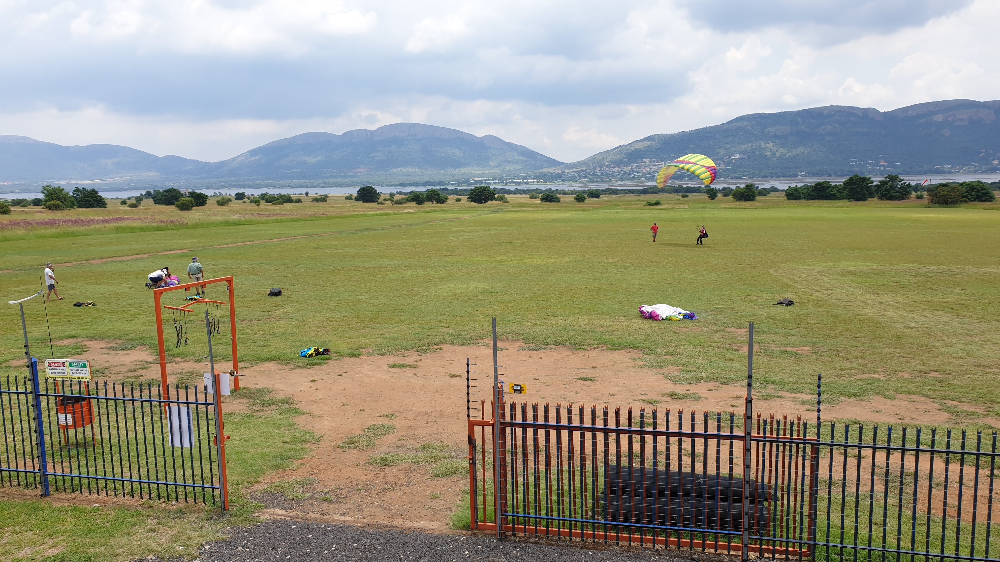
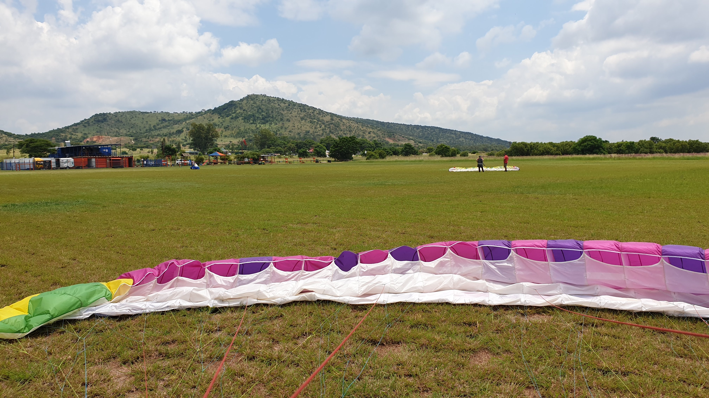

## Introduction

Welcome to my paragliding blog. This little slice of the internet will contain my thoughts and opinions around the wonderful sport of paragliding.

First, however, a little bit about how I got into the sport...

## My beginnings

### Inspiration to fly

I start every year with a new years resolution to make a change in my life.

<!--truncate-->

At the beginning of the year 2020, I had had the idea in my head to start paragliding for around 3 years, where I'd first learnt about it from the famous [Tucker Gott MacDonalds Video](https://www.youtube.com/watch?v=rvQ9DjJNal0).

### Making it happen at Harties

It was towards the end of January 2020 that I finally called up Ronnie Beukes who heads up [Skywalk Paragliding](https://www.skywalksa.com/) in Johannesburg.

I had met him on a Saturday morning, paid my money for the full course by Saturday evening and was back again on Sunday to try again. It was on the Sunday where I did my first winch.

Strapped in behind my glider, I was attached to a scooter on the back of a trailer by a long rope. Accelerating the scooter, pulled me towards the Kaptein (Ronnie). I was pulled up about 15m high, followed by a massive dive when disconnecting from the winch. That was my first taste of flying!

Unfortunately, the Kaptein was going on a training tour the following weekend to Wilderness, so my training was going to have to wait... Unless I joined them on their trip...

Monday morning was a rush! Plans going through my head on how to get my ass out of work and down to Wilderness with a bunch of people I didn't know with the intent to strap myself into a parachute and run off mountains. Crazy!

Anyways, I asked my work for a week's leave... and it was granted! That night, my flights were booked for the following Saturday morning to embark on a new adventure...

<iframe width="100%" height="315" src="https://www.youtube.com/embed/Wpuiu1GK5X8" title="YouTube video player" frameborder="0" allow="accelerometer; autoplay; clipboard-write; encrypted-media; gyroscope; picture-in-picture" allowfullscreen></iframe>
