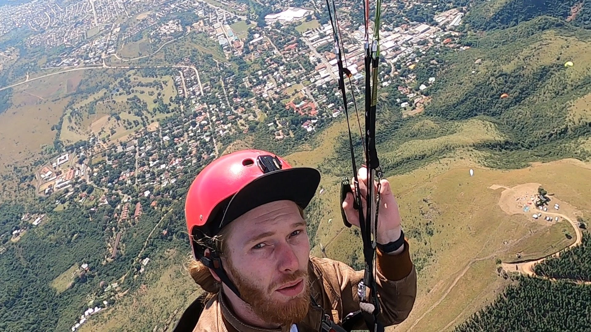
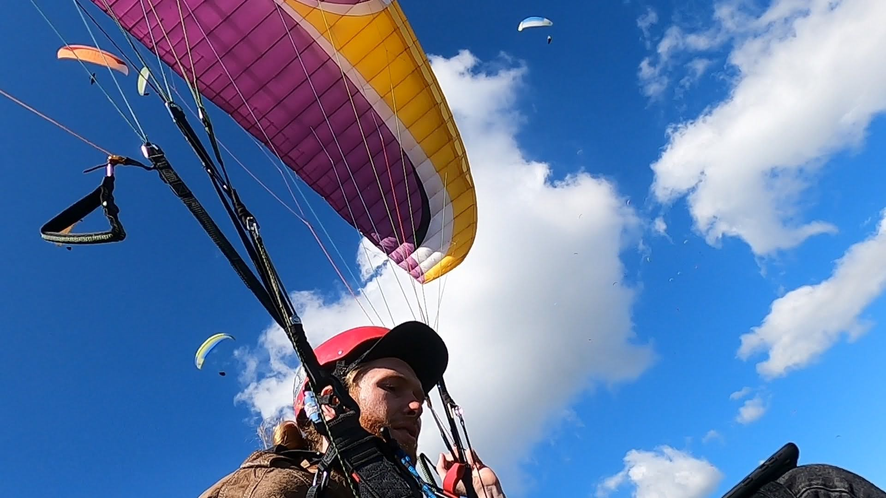
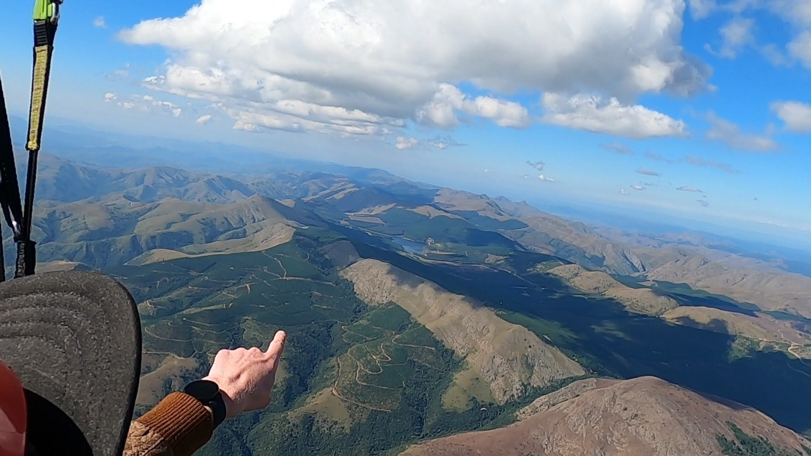

## Barberton Nationals April 2021

### Introduction

The Barberton Nationals 2021... to go, or not to go. From January 2021 I was torn with the decision.

Competitive flying for someone at my level simply seemed out of my reach. I was sitting on around 25 hours of airtime and around 50 flights (which in paragliding terms is a spring chicken 🐣).

It wasn't until I attended the Wilderness Festival in March 2021 where I met the (in?)famous Stef Juncker that I was convinced it was the right place for me... And oh my what a good decision!

_Sunset at the Barberton Golf Estate where all the pilots met up after each
days' flying to debrief and enjoy a brew🍺_

### Planning

Getting myself to Barberton, finding a place to stay, a way around and all the other logistics was actually quite a challenge. Entering a new sport leaves you in a place where you don't know neither the community nor the areas very well which means I generally had to wing everything I did!

I was staying in Wilderness at the time of the competition. From there, I organised a ride to the George airport to catch a flight to JHB with my glider and other baggage. In JHB, I rented myself a nice VW polo 4x4 (haha) which I then drove for 4 hours solo to Barberton. All on the same day! I arrived at Barberton in the afternoon to find everyone landing after the end of a great training day - awesome 👀

I met the other pilots (approximately 70!) at the Barberton Golf Estate where I checked in for the competition and got a free bag of tricks. I also got to see some of the friends I'd made at the Wilderness festival earlier that year which was awesome.

I stayed in a nice BnB which had 3 other rooms in it - all empty hmmm. anyways the details aside, I was in the place of action, with a vehicle and a place to stay!

### First Day

Going into the first competition day without any comp experience and barely knowing anyone was a daunting experience. Pressure to perform respectably was unavoidable - that's just the way humans work!

We kicked things off with a morning briefing at the Golf Estate where we were given some insight into the process. Moods were calm, relaxed and generally positive amongst the competitors. A little banter being thrown around was definitely a good sign!

After that, we embarked on the 25 minute drive up the mountain to Lone Tree Hill launch. The task briefing for the day was given to us by the task committee and we were given some guidance by Stef again on strategies for best taking on our days' challenge.

And with that, 70 pilots began launching themselves off the hill! The thermals were large and smooth and easy to find right in front of the launch area. I was thankfully able to follow the more experienced pilots straight into it and follow them on a smooth turn to the clouds!

_Picture of me about 100m above the launch site - probably 10 minutes after
taking off - with the town of Barberton in the background._

Below is the track from my first flight in Barberton. Definitely one of the highlights of my year and my first _proper_ mountain flight.

<iframe
  src="https://ayvri.com/embed/1jng0mnekd/cko7jwume00083b6ehmbfdz2r"
  allowFullScreen
  width="100%"
  height="315"
></iframe>

### Learnings from the Barberton Competition

<iframe
  width="100%"
  height="315"
  src="https://www.youtube.com/embed/zyO8gr3qfbo"
  title="YouTube video player"
  frameborder="0"
  allow="accelerometer; autoplay; clipboard-write; encrypted-media; gyroscope; picture-in-picture"
  allowFullScreen
></iframe>
