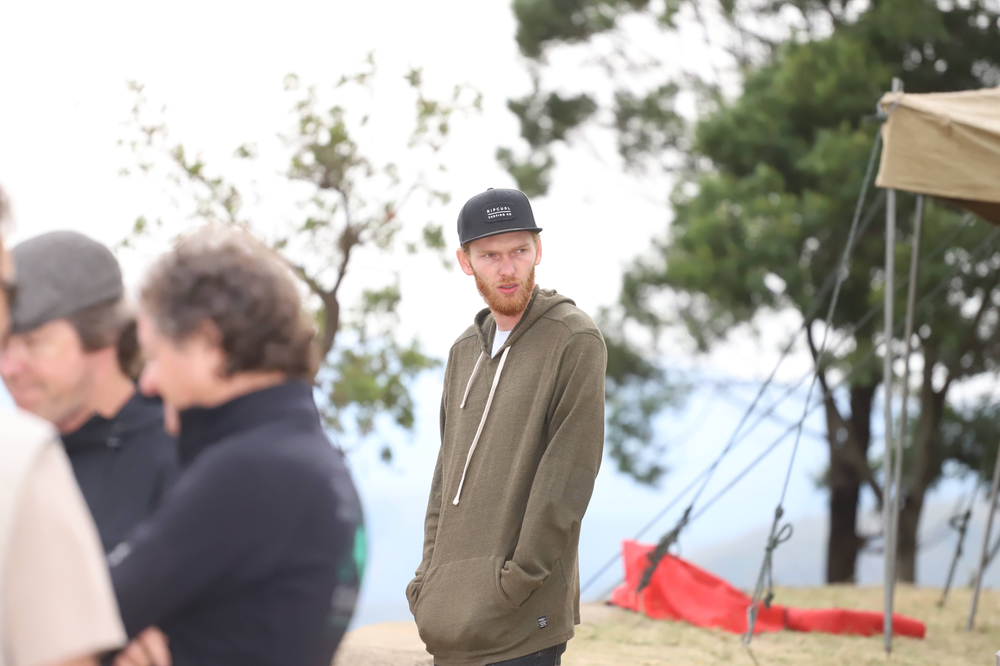

## Introduction

Welcome to my paragling blog. This little slice of the internet will contain my thoughts and opinions around the wonderful sport of paragliding.

First, however, a little bit about how I got into the sport...

## My beginnings

I start every year with a new years resolution to make a change in my life.

At the beginning of the year 2020, I had had the idea ini my head to start paragliding for around 3 years, where I'd first learnt about it from the famous [Tucker Gott MacDonalds Video](https://www.youtube.com/watch?v=rvQ9DjJNal0).

<!--truncate-->

It was towards the end of January 2020 that I finally called up Ronnie Beukes who heads up [Skywalk Paragliging](https://www.skywalksa.com/) in Johannesburg.

I met him on a Saturday morning, had paid my money for the full course by Saturday evening and was back again on Sunday.

Unfortunately, he was going on a training tour the next weekend to Wilderness, so my training was going to have to wait... Unless I joined them on their trip 🙂

<iframe width="100%" height="315" src="https://www.youtube.com/embed/Wpuiu1GK5X8" title="YouTube video player" frameborder="0" allow="accelerometer; autoplay; clipboard-write; encrypted-media; gyroscope; picture-in-picture" allowfullscreen></iframe>

Needless to say, I was hooked from there.