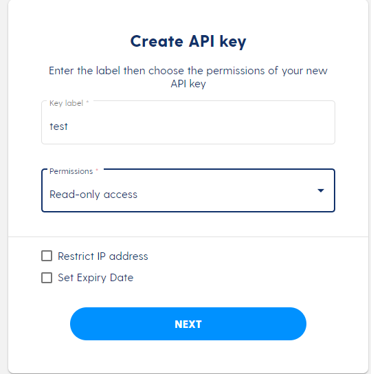

# Luno Trading Bot Setup

In this blog, we'll setup a Luno Trading bot.

The intention is to create a C# worker that will call the Luno Trading API using Basic Authentication.

<!--truncate-->

# Setup a repo

Go to the file location where you would like to create your repo and make a folder.

Open the folder with Powershell

```
git init
```

# Create a dotnet worker

Create a folder for the worker:

```
mkdir src
cd ./src
mkdir PricingWorker
```

Create the default worker

```
dotnet new worker --name PricingWorker
```

We now have a basic worker application. Test it by running:

```
dotnet run
```

You should see something logging to console output.

# Generate a C# client

Following from [this]("https://blog.johnnyreilly.com/2021/10/31/nswag-generated-c-sharp-client-property-name-clash/") blog, we can generate a C# client from the Luno API definition.

Navigate to the ./src directory running the below command:

```
cd ..
```

```
dotnet new console -o NSwag
cd NSwag
dotnet add package NSwag.CodeGeneration.CSharp
```

Copy the code in the linked blog post and modify the API definition path to be "swagger.json". Your Program.cs in the ./src/NSwag folder file should look like this:

```
using System;
using System.IO;
using System.Reflection;
using System.Threading.Tasks;
using NJsonSchema;
using NJsonSchema.Visitors;
using NSwag.CodeGeneration.CSharp;

namespace NSwag {
    class Program {
        static async Task Main(string[] args) {
            Console.WriteLine("Generating client...");
            await ClientGenerator.GenerateCSharpClient();
            Console.WriteLine("Generated client.");
        }
    }

    public static class ClientGenerator {

        public async static Task GenerateCSharpClient() =>
            GenerateClient(
                // https://github.com/OAI/OpenAPI-Specification/blob/main/examples/v2.0/json/petstore-simple.json
                document: await GetDocumentFromFile("swagger.json"),
                generatedLocation: "GeneratedClient.cs",
                generateCode: (OpenApiDocument document) => {
                    var settings = new CSharpClientGeneratorSettings();

                    var generator = new CSharpClientGenerator(document, settings);
                    var code = generator.GenerateFile();
                    return code;
                }
            );

        private static void GenerateClient(OpenApiDocument document, string generatedLocation, Func<OpenApiDocument, string> generateCode) {
            var root = Path.GetDirectoryName(Assembly.GetEntryAssembly().Location);
            var location = Path.GetFullPath(Path.Join(root, @"../../../", generatedLocation));

            Console.WriteLine($"Generating {location}...");

            var code = generateCode(document);

            System.IO.File.WriteAllText(location, code);
        }

        private static async Task<OpenApiDocument> GetDocumentFromFile(string swaggerJsonFilePath) {
            var root = Path.GetDirectoryName(Assembly.GetEntryAssembly().Location);
            var swaggerJson = await File.ReadAllTextAsync(Path.GetFullPath(Path.Join(root, swaggerJsonFilePath)));
            var document = await OpenApiDocument.FromJsonAsync(swaggerJson);

            return document;
        }
    }
}
```

Download the Luno API definition from [here]("blob:https://www.luno.com/99404f7d-d754-4a65-801b-a6bf87c486fc")

Paste the "swagger.json" file you downloaded into the folder ./src/NSwag

Run the code client generation code using the below command (make sure you run the command from the ./src/NSwag directory):

```
dotnet run
```

You should notice a C# client in the ./src/NSwag folder called "GeneratedClient.cs".

Copy the GeneratedClient.cs to the folder ./src/PricingWorker/ApiClient

Change the namespace in the client to be:

```
namespace PricingWorker.ApiClients
```

Add the nuget package "NewtonSoft.Json" to your PricingWorker Project by running:

```
dotnet add package Newtonsoft.Json
```

Change back to the PricingWorker Directory

```
cd ../PricingWorker
```

Run the worker to see if it builds and runs

```
dotnet run
```

You should see console output in the powershell terminal.

We have now created a worker that has a class in it which has all the functionality we need to call the Luno API.

# Call the Luno API

First things first is we need to generate an API key. Assuming you have a Luno account already, go to [this]("https://www.luno.com/wallet/security/api_keys") link and create an API key. For now, give it readonly permissions.



You should get a key and a secret - save these 2 values into your appsettings.json so it looks like so:

_NB: We will not check this in to source control - it's just for testing purposes at this point_

```
{
  "Logging": {
    "LogLevel": {
      "Default": "Information",
      "Microsoft.Hosting.Lifetime": "Information"
    }
  },
  "Luno": {
    "Key": "<Your Key>",
    "Secret": "<Your Secret>"
  }
}

```

We now have the means to authenticate our code to make calls under the identity of our Luno account. Let's integrate the security into our C# client.

In your GeneratedClient.cs, modify the constructor to take a key and secret parameter and add it to the client requests as a basic auth header as per below:

```
public Client(System.Net.Http.HttpClient httpClient, string key, string secret)
{
    _httpClient = httpClient;
    var authToken = Encoding.ASCII.GetBytes($"{key}:{secret}");
    _httpClient.DefaultRequestHeaders.Authorization = new AuthenticationHeaderValue("Basic",
            Convert.ToBase64String(authToken));
    _settings = new System.Lazy<Newtonsoft.Json.JsonSerializerSettings>(CreateSerializerSettings);
}
```

Now in the worker, instantiate the client and pass it the key and secret you saved in your appsettings.json earlier. Your worker Execute function should look like the following:

```
protected override async Task ExecuteAsync(CancellationToken stoppingToken)
{
    while (!stoppingToken.IsCancellationRequested)
    {
        _logger.LogInformation("Worker running at: {time}", DateTimeOffset.Now);

        using (var httpClient = new HttpClient())
        {
            var client = new Client(httpClient, _config["Luno:Key"], _config["Luno:Secret"]);

            var result = await client.MarketsAsync();

            Console.WriteLine($"Luno returned a response showing {result.Markets.Count} markets");
        }

        await Task.Delay(1000, stoppingToken);
    }
}
```

Now run the service and you should see something logged to your console as below:

```
Luno returned a response showing 29 markets
```

If you have not done things correctly, you will likely get an unauthorised response from this call.
